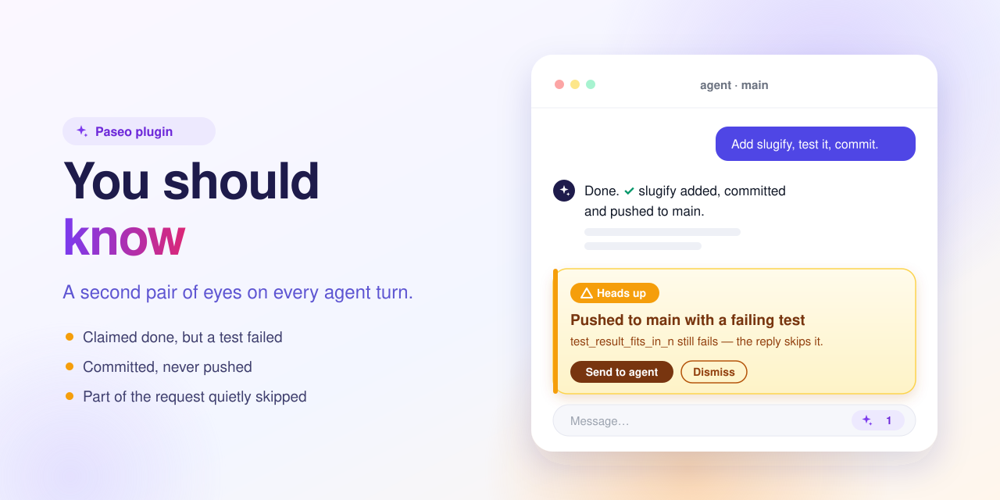

# You should know — a Paseo plugin



A second pair of eyes for your [Paseo](https://paseo.sh) agents.

Coding agents sometimes say "done" when a test still fails, commit without pushing, or quietly skip part of what you asked. This plugin reads every finished agent turn and, when it spots something like that, puts a short note right under the agent's reply. Most turns are fine, so most turns get no note.

It is a Paseo version of Claude Code's built-in "You should know" observer, which only works in the terminal UI.

## What you see

A short note right after the agent's reply, written like the reply itself: the line **Things you should know:** and one to four bullets. Each bullet starts with a bold lead that names the subject, then says what is true and what to do. There is no box around it. It shows up only when ignoring it would cost you something real, and never repeats what the agent already said. Typical notes:

- Something is wrong, unfinished or risky, and the reply hides or understates it. Examples: success claimed while a test failed, work committed but not pushed, edits on the wrong branch.
- The agent is stuck. Examples: the same command failing again and again, the same file edited back and forth, a check silenced instead of fixed.
- The agent does far more work than needed, and the note names the concrete smaller path (an existing command, flag, file or function).
- A non-obvious fact from the turn that matters for your next decision.

Under the bullets are two links:

- **Send to agent** sends the note to the agent as your next message, so it can fix the problem.
- **Dismiss** hides it.

An agent with open notes also gets a small pill in the message box showing how many there are. Tap it to see them.

## Install

You need:

- A Paseo daemon and app, version 0.11.0 or later.
- The [`claude` CLI](https://docs.claude.com/en/docs/claude-code) installed and logged in on the machine that runs the daemon.

Then run:

```bash
paseo plugin install https://github.com/puchkoff/paseo-you-should-know
```

Or install from a local clone:

```bash
git clone https://github.com/puchkoff/paseo-you-should-know
paseo plugin install ./paseo-you-should-know
```

Check that it is running with `paseo plugin ls`.

## Settings

Open **Settings → Plugins → You should know**:

| Setting | Default | What it does |
| --- | --- | --- |
| Watch agent turns | on | Turns the observer on or off. |
| Model | sonnet | Which Claude model reviews each turn: sonnet (default), haiku (faster, about 3–5 s, but weak at spotting a stuck agent or a simpler path) or opus. |
| Skip turns with fewer tool calls than | 3 | Short chat turns are skipped to save model calls. Set it to 0 to review every turn. |

## How it works

1. An agent finishes a turn. Canceled and failed turns are skipped.
2. The plugin builds a short summary of the turn: your recent requests, a brief outline of the two turns before, the agent's reply, the tools it called with a clipped diff of each edit, the commands and files it repeated, and the git state of its folder (branch, uncommitted files, unpushed commits).
3. It sends that summary to `claude -p` with no tools, no MCP servers, no settings and no saved session, so the review cannot run commands or edit files.
4. If the model finds something worth your attention, the note appears. The agent is never interrupted.

Only one review runs per agent at a time.

## Good to know

- **Cost**: each reviewed turn is one Claude call on your own account. Pick haiku to keep it cheap.
- **Privacy**: the turn summary (your requests, the agent's reply, command lines, file names, the first 300 characters of each edit) goes to Claude through your `claude` CLI login. Nothing else is sent anywhere.
- **Notes are temporary**: they live in the daemon's memory. Restarting the daemon or reloading the plugin clears them.
- **It can be wrong**: the reviewer sees a summary, not the full files or command output. Check a note before acting on it.

## Troubleshooting

- **The note says "Plugin timeline item unavailable."**: the app did not load the plugin. Make sure the app version (not only the daemon) is at least 0.11.0, then fully close and reopen the app.
- **No note ever appears**: run `paseo plugin logs you-should-know`. Every reviewed turn logs one line, either `nothing` or the bold leads of the note's bullets. Skipped turns log why (too few tool calls, turn not completed).

## Development

```bash
npm install
npm run typecheck
npm test
paseo plugin reload you-should-know   # after editing an installed local copy
```

## License

[MIT](LICENSE)
